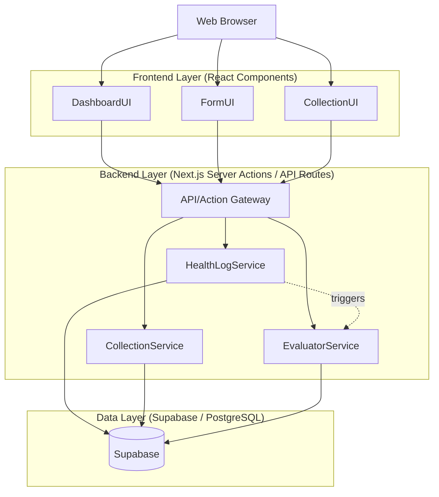
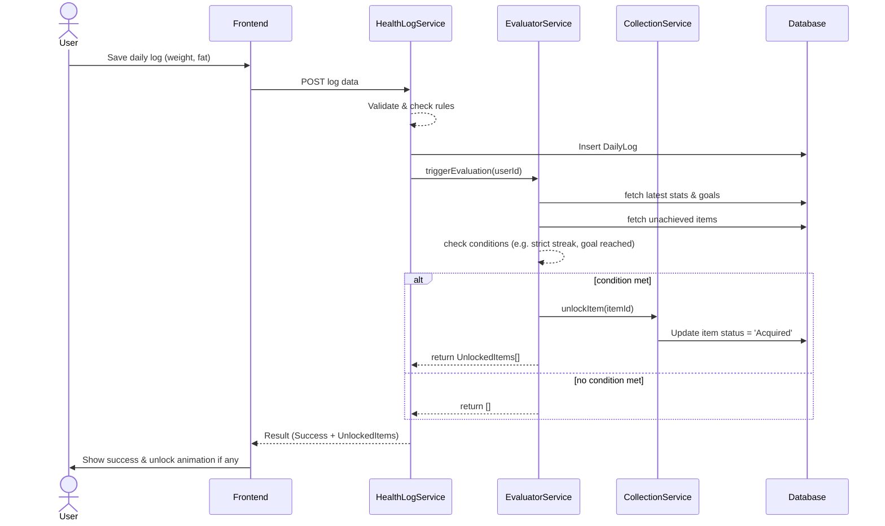

# Design Document: 体重管理アプリ

---
**Purpose**: Provide sufficient detail to ensure implementation consistency across different implementers, preventing interpretation drift.
---

## Overview 
**Purpose**: この機能は、日々の体重・体脂肪率の記録と、ユーザー独自の「コレクション要素」を組み合わせた健康管理・モチベーション維持ツールを提供します。
**Users**: 体重や体脂肪率の推移を直感的に把握つつ、日々の継続により独自のコレクション（例：仮想の称号、ご褒美スイーツリスト）を獲得して楽しみたい一般ユーザー。
**Impact**: 単なる記録アプリにゲーミフィケーション要素を取り入れ、ユーザー自身が定義したコレクションアイテムを開放するロジックやデータモデルを新規導入します。システムとしては、Next.js + Vercelによるデプロイと、バックエンドデータストアとしてのSupabase（PostgreSQL）の構成を利用したWebベースダッシュボードを想定。

### Goals
- 日次の体重・体脂肪率の確実な記録とグラフへの可視化
- ユーザーによる任意のコレクションテーマおよびアイテムの作成
- 体重記録や目標達成状況に連動したアイテム獲得ロジックの実行
- 獲得されたアイテムの視覚的な演出と一覧表示

### Non-Goals
- SNS機能やユーザー間のコレクション共有昨日（今回は個人向けに限定）
- カロリー管理や食事記録といった複雑なヘルスログの拡充（体重・体脂肪率のみ）
- iOS/Android向けネイティブアプリの実装（まずはPWA/WebアプリとしてNext.jsバックエンドで実現）

## Architecture

### Architecture Pattern & Boundary Map


**Architecture Integration**:
- Selected pattern: **Monolithic Web Architecture using Next.js App Router API / Server Actions deployed on Vercel**
- Domain/feature boundaries: 
  - `HealthLog Domain`: ユーザーの体重、体脂肪率、目標体重の管理を担う。
  - `Collection Domain`: コレクションテーマ・アイテムの設定、獲得状況（アンロック管理）を担う。
  - `Evaluator Engine`: 記録が追加された際に、獲得条件を判定するフックロジックを独立させる。
- New components rationale: 記録後の獲得条件判定処理（`EvaluatorService`）をデータ登録系サービスから分離し、テスト性と保守性を向上させる。

### Technology Stack

| Layer | Choice / Version | Role in Feature | Notes |
|-------|------------------|-----------------|-------|
| Frontend | React (Next.js), TailwindCSS, Chart.js (or Recharts) | ユーザーインタフェース、グラフの描画、獲得演出アニメーション | グラフにはRechartsを推奨 |
| Backend | Next.js Server Actions / APIs, Zod | UIからの入力バリデーション、DBアクセス、条件判定ロジックの実行 | Vercelへのデプロイを前提としたServerless構成 |
| Data | Supabase (PostgreSQL), Prisma(or Supabase Client) | ドメインモデルの永続化、履歴データの保存 | クラウドネイティブなスケーラビリティとリアルタイム同期対応 |

## System Flows

### Item Unlock Flow

*Flow level decision*: The evaluation is synchronous during the save operation to provide immediate UI feedback to the user on unlock events.

## Requirements Traceability

| Requirement | Summary | Components | Interfaces | Flows |
|-------------|---------|------------|------------|-------|
| 1.1 - 1.4 | 体重・体脂記録フォームおよび履歴保持 | `LogEntryForm`, `HealthLogService` | Server Action: `saveDailyLog` | |
| 1.5 | 入力完了後の条件判定処理 | `EvaluatorService` | Service Method: `evaluateUnlocks` | Item Unlock Flow |
| 2.1 - 2.4 | ダッシュボードとグラフ表示、期間切替 | `DashboardView`, `TrendChart` | API: `getLogHistory` | |
| 3.1 - 3.3 | 目標管理・差分表示と達成UI | `TargetSettingForm`, `HealthOverview` | API: `getUserTarget`, `updateTarget` | |
| 4.1 - 4.3 | コレクションテーマ登録・一覧・削除 | `ThemeManager` | API: `createTheme`, `listThemes`, `deleteTheme` | |
| 5.1 - 5.3 | アイテム登録・一覧と獲得状況 | `ItemManager`, `CollectionGallery` | API: `createItem`, `listItemsByTheme` | |
| 6.1 - 6.2 | アイテム獲得判定および獲得演出 | `EvaluatorService`, `UnlockNotification` | Service Method: `evaluateUnlocks` | Item Unlock Flow |

## Components and Interfaces

| Component | Domain/Layer | Intent | Req Coverage | Key Dependencies (P0/P1) | Contracts |
|-----------|--------------|--------|--------------|--------------------------|-----------|
| `HealthLogService` | Backend | 体重記録のCRUD操作 | 1.*, 3.* | `Database` (P0), `EvaluatorService` (P1) | API |
| `CollectionService` | Backend | テーマとアイテムのCRUD | 4.*, 5.* | `Database` (P0) | API |
| `EvaluatorService` | Backend | アイテム獲得条件の計算とフック実行 | 1.5, 6.1 | `HealthLogService` (P1), `CollectionService` (P1) | Service |
| `DailyLogPanel` | Frontend | 記録の入力コンポーネント | 1.1-1.4 | `HealthLogService` (P0) | API |
| `TrendChart` | Frontend | 推移グラフの描画 | 2.1-2.4 | `HealthLogService` (P0) | API |
| `CollectionBoard` | Frontend | テーマ・アイテムの閲覧 | 4.*, 5.*, 6.2 | `CollectionService` (P0) | API |

### Backend Domain

#### HealthLogService
| Field | Detail |
|-------|--------|
| Intent | Handle CRUD for daily logs and target weight. Orchestrates unlocking rules after save. |
| Requirements | 1.1, 1.2, 1.3, 1.4, 3.1, 3.2 |

**Responsibilities & Constraints**
- Validates inputs strictly (positive numbers, reasonable limits)
- Writes daily limits (one entry per day, or overwrite on same day)
- Triggers evaluator after a successful write

**Dependencies**
- Inbound: Next.js API Routes/Server Actions (P0)
- Outbound: `Database` (P0), `EvaluatorService` (P0)

**Contracts**: API [x] 

##### API Contract
```typescript
interface SaveLogRequest {
  date: string; // ISO8601 YYYY-MM-DD
  weight: number; 
  bodyFat?: number;
}
interface SaveLogResponse {
  success: boolean;
  logId: string;
  unlockedItems: ReadonlyArray<ItemModel>;
}

// target
interface UpdateTargetRequest {
  targetWeight: number;
}
```

#### EvaluatorService
| Field | Detail |
|-------|--------|
| Intent | Synchronous evaluation engine that computes unlock progress. |
| Requirements | 1.5, 6.1 |

**Responsibilities & Constraints**
- Computes streaks (consecutive days of logs) and goal delta.
- Identifies locked items matching criteria and transitions them to unlocked.
- Emits events or returns unlocked items directly to the caller.

**Contracts**: Service [x]

##### Service Interface
```typescript
interface EvaluatorService {
  /** Returns array of items that were unlocked during this transaction */
  evaluateUnlocks(userId: string): Promise<Result<ItemModel[], Error>>;
}
```

#### CollectionService
| Field | Detail |
|-------|--------|
| Intent | Manages Collection Themes and Items. |
| Requirements | 4.*, 5.* |

**Contracts**: API [x]

##### API Contract
```typescript
interface CreateThemeRequest {
  name: string;
  description?: string;
}

interface CreateItemRequest {
  themeId: string;
  name: string;
  description?: string;
  unlockConditionType: 'STREAK_DAYS' | 'TARGET_REACHED' | 'MANUAL';
  unlockConditionValue: number; // e.g., streak of 5 days
}
```

### Frontend Domain

#### DashboardUI
**Implementation Notes**:
- Use React Query, SWR, or native Next.js caching to fetch the latest graphs.
- Needs to manage the state of the "Unlock Celebration" modal if `unlockedItems` array from the `HealthLogService` POST response has elements length > 0.
- Target weight delta should be evaluated on the client purely for presentation based on the fetched logs and targets.

## Data Models

### Logical Data Model

**User (Assumed 1 user for local auth, or managed auth)**
- `id` (PK)

**DailyLog**
- `id` (PK)
- `userId` (FK) -> User
- `date` (Date/String 'YYYY-MM-DD', Unique constraints on `userId` + `date`)
- `weight` (Float, not null)
- `bodyFat` (Float, nullable)
- `createdAt`
- `updatedAt`

**UserTarget**
- `userId` (PK/FK) -> User
- `targetWeight` (Float, not null)
- `updatedAt`

**CollectionTheme**
- `id` (PK)
- `userId` (FK) -> User
- `name` (String, not null)
- `description` (String, nullable)
- `createdAt`

**CollectionItem**
- `id` (PK)
- `themeId` (FK) -> CollectionTheme (Cascade Delete)
- `name` (String, not null)
- `description` (String, nullable)
- `status` (Enum: `LOCKED`, `ACQUIRED`)
- `acquiredAt` (Date, nullable)
- `conditionType` (Enum: `STREAK_DAYS`, `TARGET_REACHED`, `MANUAL`)
- `conditionValue` (Float/Int, specifies the threshold required to unlock)

**Consistency & Integrity**:
- Deleting a CollectionTheme must cascade-delete all CollectionItems under it (Requirement 4.3).
- Ensuring exactly one log entry per day per user (Upsert pattern required).

## Error Handling

### Error Strategy
- Validation errors on logs (e.g., negative weight) should return a 400 Bad Request indicating the specific field and reason, mapped visually in the UI.
- API failures in deleting constraints (e.g., deleting a non-existent theme) gracefully return HTTP 404.

### Error Categories and Responses
**User Errors** (4xx): 
  - `400 Bad Request`: Validation failure via Zod.
  - `409 Conflict`: (If trying to insert duplicate daily log directly without upsert). We will handle via Upsert transparently to user instead.
**Business Logic Errors** (422): If attempting to manual unlock an item already unlocked.
**System Errors** (5xx): Supabase Database connection or timeout errors.

## Testing Strategy
- Unit Tests: 
  - Zod data validation schemas for DailyLog inputs (ensure positives, limits).
  - EvaluatorService logic (verify streak calculations, verify target hit calculation).
- Integration Tests: 
  - Submitting a daily log properly triggers EvaluatorService and correctly updates a CollectionItem from `LOCKED` to `ACQUIRED` in the test DB context.
  - Cascading deletion of a Theme validating child Items are deleted.
- E2E/UI Tests: 
  - Save log flow -> Verify chart updates -> Verify Celebration Modal appears if item is unlocked.
